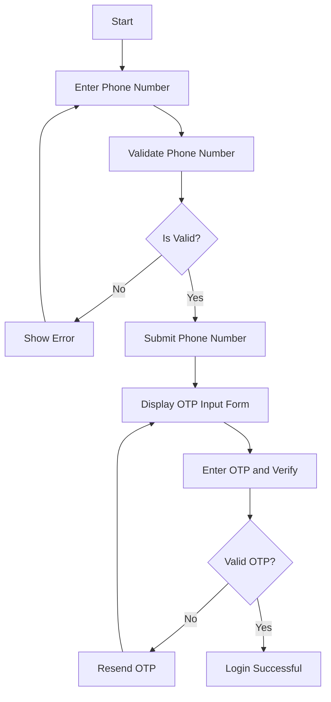

# OTP Login System with React and Tailwind CSS

This project demonstrates an OTP (One-Time Password) login flow built using **React.js** and **Tailwind CSS**. It features a phone number input form, OTP verification, and a resend OTP functionality with a countdown timer.

## Features

- **Phone Number Input**: Users can input their phone numbers with a selected country code.
- **OTP Verification**: A 6-digit OTP input field with real-time validation.
- **Resend OTP**: A timer-based OTP resend button to prevent spam requests.
- **User-Friendly Interface**: Designed with Tailwind CSS for responsiveness and modern UI.

## Progress Flow Diagram

Below is the flowchart that represents the functionality of the OTP Login System:



## Project Structure

```
.
├── node_modules/           # Dependencies
├── public/                # Static files
├── src/
│   ├── components/
│   │   ├── OtpInput.jsx   # OTP input component
│   │   └── PhoneOtpForm.jsx # Phone number form component
│   ├── App.css
│   ├── App.jsx           # Main application component
│   ├── index.css         # Global styles
│   └── main.jsx          # Entry point
├── .gitignore            # Git ignore configuration
├── eslint.config.js      # ESLint configuration
├── index.html            # HTML template
├── package-lock.json     # Lock file for dependencies
├── package.json          # Project configuration and dependencies
├── postcss.config.js     # PostCSS configuration
├── README.md            # Project documentation
├── tailwind.config.js    # Tailwind CSS configuration
└── vite.config.js       # Vite configuration
```

## Getting Started

1. Clone the repository:
   ```bash
   git clone https://github.com/chuck-ankit/100xDev-Cohort.git
   ```

2. Install dependencies:
   ```bash
   cd 100xDev-Cohort/WebDevelopment/Code/Week-13-Tailwind-CSS/otp-login
   npm install
   ```

3. Start the development server:
   ```bash
   npm run dev
   ```

## Technologies Used

- React.js
- Tailwind CSS
- Vite (for build tooling)

## Contributing

1. Fork the repository
2. Create your feature branch (`git checkout -b feature/amazing-feature`)
3. Commit your changes (`git commit -m 'Add some amazing feature'`)
4. Push to the branch (`git push origin feature/amazing-feature`)
5. Open a Pull Request

## License

This project is licensed under the MIT License - see the [LICENSE](LICENSE) file for details.
